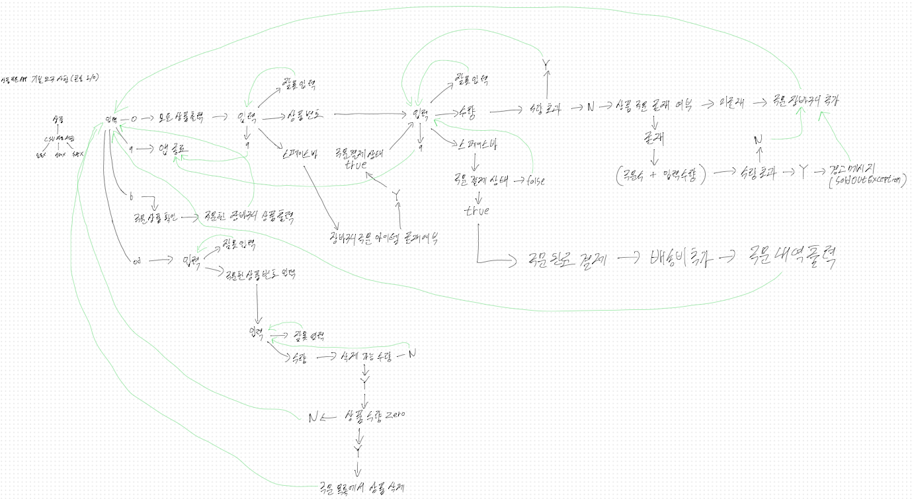

# 상품 주문 프로그램

## 사용 기술
- java 16
- gradle 7.6.1
- spring boot 2.7.12

## 조건
- 로컬 콘솔을 통한 입출력 환경
- 요구사항 정의되지 않은 부분 자유롭게 수정하고 정의
- 프레임워크, 라이브러리 자유롭게 사용

## 기본 요구 사항 (상품 주문 프로그램)
- 상품
   - 상품 정보
     - 고유한 상품 번호 (Item.id)
     - 상품명 (Item.name)
     - 판매가격 (Item.price)
     - 재고 수량 (Item.stockQuantity)
- 주문
  - 상품 번호, 수량 입력 (반복 입력 가능), 주문 내역에서 합산된 결과
  - 배송비: 2,500원 (총 결제 금액 5만원 미만 배송비) 
  - 주문 완료 & 결제 -> 주문 정보 출력
- 예외
  - 주문 시점에 재고 수량이 없는 경우 SoldOutException 발생
- 테스트
  - 멀티 스레드 요청으로 SoldOutException 동작 체크 단위 테스트 작성

## 입출력 정보
- 입력
  - o (주문)
    - 상품 번호 입력
      - SPACE + 엔터 -> 결제 준비 상태
    - 수량 입력
      - SPACE + 엔터 -> 주문 완료
  - q (앱 종료)
    - 프로그램 종료
  - b (장바구니)
    - 주문한 상품 조회
  - d (주문 상품 수량 제거)
    - 상품 번호 입력 -> 주문한 상품 id 입력
    - 수량 입력 -> 주문 상품 수량 제거

# 구현 방향
- 구현 시작은 Application.java에서 시작합니다.
- 주문 동시성 이슈는 java의 synchronized, ConcurrentHashMap, ConcurrentLinkedQueue를 통해 제어
  - java의 synchronized는 하나의 프로세스에서만 동기가 보장된다고 알고 있어서 dbms를 사용한다면 제공하는 lock으로 레이스 컨디션을 제어 필요
- 멀티 스레드 테스트
  - OrderServiceTest.Java -> 주문_멀티_스레드_테스트
  - ItemTest.Java -> 주문_멀티_스레드_테스트
  - ApplicationTests.Java -> 임시 테스트입니다. (시스템 예외 발생)
- 개발 완료 마인드맵

1. 스프링을 최소한 사용할 수 있도록 변경 후 개발
2. 최대한 콘솔로 제어함에 있어서 충분한 설명과 안내를 이용자에게 안 
3. 콘솔 입력함에 있어서, 상품 번호, 수량을 입력할 때도 자유롭게 q를 이용해 애플리케이션 종료 가능
4. 이용자는 하나의 주문으로 상품의 주문 수량을 넘을 수 없지만, 여러 번의 주문으로 같은 상품의 수량을 저장 수량을 넘길 수 없음. 그러나 넘길 시 주문 완료 및 결제 불가
5. 이용자는 3개의 주문 상품을 추가하고 주문을 했을 때, 1개의 상품이 주문 가능 상태가 아니라면, 2개의 정상 주문 상품이 저장된 상품 수량에서 제외된 경우 저장 상품의 수량을 회복(복구)하여 주문 전 수량으로 원복  
6. 솔드아웃 예외가 발생한 경우, 상품 이름을 같이 안내하여 어떤 상품이 솔드아웃됐는지 안내 (3개가 솔드아웃이라면, 먼저 발견된 1개만 안내)
7. 주문을 하고, 결제하기 전 까진 주문시(o) 출력되는 아이템의 수량은 마이너스가 되지 않음
